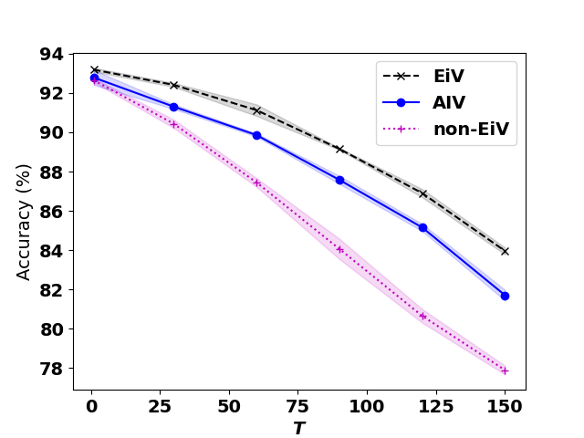
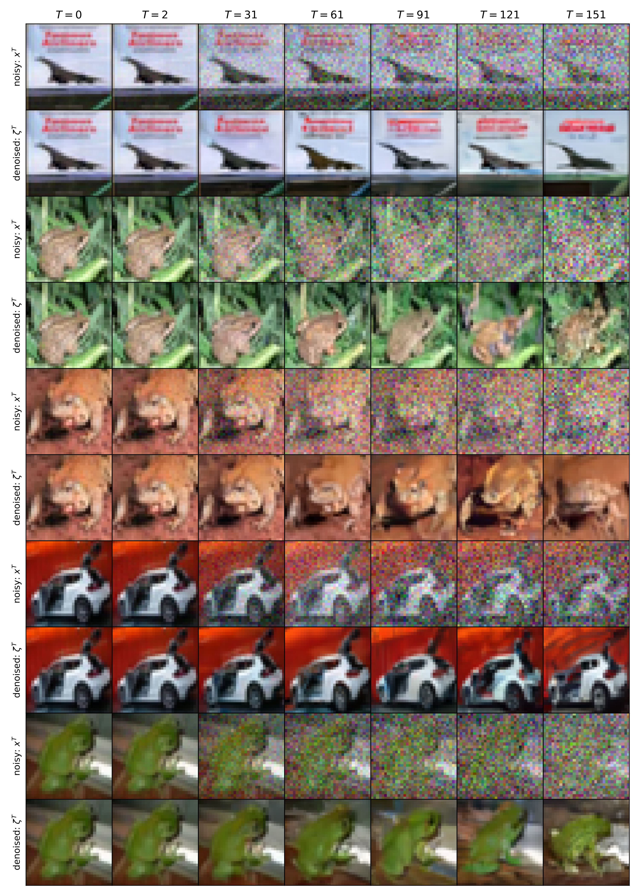

# Deep Errors-in-Variables using a Diffusion Model

This repository is the official implementation of [Deep Errors-in-Variables using a Diffusion Model](). 

This paper shows that training a classification network with the statistical model Errors-in-Variables leads to an improvement in accuracy and to better calibrated neural networks. 

## Requirements

Create a virtual environment with `python==3.10`. You can create a predefined `conda` environment with
```setup
conda env create -f utils/create_env.yml
```
Open the environment (e.g. `conda activate EiV`) and install the required packages via `pip`.  

```setup
pip install -r utils/requirements.txt
```

## Run the code

The different configurations are managed by [Hydra](https://hydra.cc/docs/intro/).
The default settings in the `bash` scripts are for CIFAR10 at noise level $T=120$. For different configurations (e.g. noise level) the arguments in the corresponding bash scripts can be adapted.

We provide additional [data](https://drive.google.com/file/d/15JFgqHZVA8tS_Da3AXASzzW3KgliAFmD/view?usp=sharing) for CIFAR10 at noise level $T=120$. The weights of the diffusion model can be used to generate the datasets for all noise levels. Hence, for CIFAR10 the training of the diffusion model can be skipped and the generation of the dataset and the training of the classification network is not necessary for noise level $T=120$.

Note: if you run out of memory reduce the batch size in the corresponding scripts.


### Training

To train the diffusion model on CIFAR10, run:

```sh
. run_diff_train.sh
```

The datasets needed for training the statistical models Errors-in-Variables and Average-Input-Variables can be generated with
```sh
. run_generate_dataset.sh
```

To train the classification network for Errors-in-Variables with noise data, run:

```sh
. run_pred_train.sh
```


## Evaluation

To generate a dataframe of the prediction performance on the test dataset, run: 

```sh
. run_pred_infer.sh
```

A numpy array with the posterior predictives for all three statistical models Errors-in-Variables (EiV), standard training (non-EiV) and Average-Input-Variables (AIV) can be generated with

```sh
. run_pred_store.sh
```

## Pre-trained models

For CIFAR10 we provide
1. the weights of the diffusion model 
2. the weights of the classification networks trained on $T=120$ for EiV, AIV and non-EiV
3. the training and test datasets for $T=120$ 
4. the posterior predictives for $T=120$

Please consult the following [link](https://drive.google.com/file/d/15JFgqHZVA8tS_Da3AXASzzW3KgliAFmD/view?usp=sharing)
to download `dataEiV.zip` that contains the data associated with 1. - 4.

The folder structure is chosen such that the required data can be loaded by the scripts. 

## Results of the paper

The statistical model EiV leads to a superior prediction performance compared to non-EiV and AIV training. $T$ is a measure of noisiness of the data. 



EiV leads to more accurate predictions compared the AIV and non-EiV if the noisiness of the images is taken into account.

## Denoising capability of the Diffusion model


Visualization of noisy and denoised examples from CIFAR10 at different noise levels $T$. The diffusion model is used to denoise the images. At each noise level $T$ , $x^T$ is the input for non-EiV and $\zeta^T$ is used for EiV and AIV.



## Generating an MNIST image from standard Normal distribution

The diffusion model can map samples from one distribution to another one. Here a sample from a standard Normal distribution is mapped to a sample of the MNIST-distribution. The following `gif` shows how the transformation is done step by step.


## Disclaimer

This software was developed at Physikalisch-Technische Bundesanstalt (PTB). The software is made available "as is" free of cost. PTB assumes no responsibility whatsoever for its use by other parties, and makes no guarantees, expressed or implied, about its quality, reliability, safety, suitability or any other characteristic. In no event will PTB be liable for any direct, indirect or consequential damage arising in connection

## Licence

MIT License

Copyright (c) 2023 Datenanalyse und Messunsicherheit, working group 8.42, PTB Berlin

Permission is hereby granted, free of charge, to any person obtaining a copy of this software and associated documentation files (the "Software"), to deal in the Software without restriction, including without limitation the rights to use, copy, modify, merge, publish, distribute, sublicense, and/or sell copies of the Software, and to permit persons to whom the Software is furnished to do so, subject to the following conditions:

The above copyright notice and this permission notice shall be included in all copies or substantial portions of the Software.

THE SOFTWARE IS PROVIDED "AS IS", WITHOUT WARRANTY OF ANY KIND, EXPRESS OR IMPLIED, INCLUDING BUT NOT LIMITED TO THE WARRANTIES OF MERCHANTABILITY, FITNESS FOR A PARTICULAR PURPOSE AND NONINFRINGEMENT. IN NO EVENT SHALL THE AUTHORS OR COPYRIGHT HOLDERS BE LIABLE FOR ANY CLAIM, DAMAGES OR OTHER LIABILITY, WHETHER IN AN ACTION OF CONTRACT, TORT OR OTHERWISE, ARISING FROM, OUT OF OR IN CONNECTION WITH THE SOFTWARE OR THE USE OR OTHER DEALINGS IN THE SOFTWARE.

## References

If you find this work useful, you may want to cite our paper. 
(To be included)
